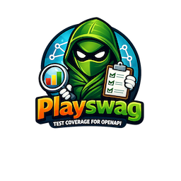

# playswag

<p align="center">
  
</p>

> Playwright API coverage tracking against Swagger / OpenAPI specifications.

`playswag` transparently wraps Playwright's built-in `request` fixture to record every API call made during your tests, then compares the results against your OpenAPI spec(s) to report coverage across four dimensions:

| Dimension | What it measures |
|-----------|------------------|
| **Endpoints** | Which path + method combinations were called at all |
| **Status codes** | Which response codes defined in the spec were actually exercised |
| **Parameters** | Which query/path/header params were supplied |
| **Body properties** | Which request body fields were provided |

Works with **multiple workers** out of the box — per-worker data is collected via test attachments and aggregated in the reporter process after all tests complete.

---

## Installation

```bash
npm install --save-dev playswag
```

`@playwright/test >=1.20.0` is a required peer dependency.

---

## Quick start

### 1. Replace your import

```diff
-import { test, expect } from '@playwright/test';
+import { test, expect } from 'playswag';
```

That's it. The `request` fixture is transparently wrapped — existing tests need no other changes.

### 2. Add the reporter to `playwright.config.ts`

```ts
import { defineConfig } from '@playwright/test';

export default defineConfig({
  reporter: [
    ['list'],
    ['playswag/reporter', {
      // Required: one or more spec sources (file paths or URLs)
      specs: ['./openapi.yaml'],

      // Optional
      outputDir: './playswag-coverage',
      outputFormats: ['console', 'json'],   // default

      threshold: {
        endpoints: 80,         // warn / fail if < 80% of endpoints are hit
        statusCodes: 60,
      },
      failOnThreshold: false,  // set true to fail the run when thresholds aren't met
    }],
  ],
  use: {
    baseURL: 'https://api.example.com',  // auto-detected by the reporter
  },
});
```

### 3. Run your tests

```bash
npx playwright test
```

Coverage is printed to the terminal and written to `./playswag-coverage/playswag-coverage.json`.

---

## Configuration reference

All options are passed as the second element of the reporter tuple in `playwright.config.ts`.

```ts
interface PlayswagConfig {
  /**
   * OpenAPI / Swagger spec source(s).
   * Accepts local file paths (.yaml / .json), remote URLs, or an array of both.
   * Supports Swagger 2.0 and OpenAPI 3.0 / 3.1.
   */
  specs: string | string[];

  /** Output directory for generated files. @default './playswag-coverage' */
  outputDir?: string;

  /** Which output formats to produce. @default ['console', 'json'] */
  outputFormats?: Array<'console' | 'json'>;

  /**
   * Base URL of the API under test.
   * Auto-detected from playwright.config.ts `use.baseURL` if not provided.
   */
  baseURL?: string;

  /** Only track API calls whose paths match these glob patterns. */
  includePatterns?: string[];

  /** Ignore API calls whose paths match these glob patterns. */
  excludePatterns?: string[];

  consoleOutput?: {
    enabled?: boolean;            // @default true
    showUncoveredOnly?: boolean;  // @default false
    showDetails?: boolean;        // @default true — per-operation table
    showParams?: boolean;         // @default false
    showBodyProperties?: boolean; // @default false
  };

  jsonOutput?: {
    enabled?: boolean;    // @default true
    fileName?: string;    // @default 'playswag-coverage.json'
    pretty?: boolean;     // @default true
  };

  threshold?: {
    endpoints?: number;       // 0–100
    statusCodes?: number;
    parameters?: number;
    bodyProperties?: number;
  };

  /**
   * When true, the test run is marked as failed if any threshold is not met.
   * @default false — thresholds are informational only by default
   */
  failOnThreshold?: boolean;
}
```

### Per-project / per-file opt-out

```ts
// In playwright.config.ts — disable coverage for a specific project
projects: [
  {
    name: 'no-coverage',
    use: { playswagEnabled: false },
  },
]

// Or inside a test file
test.use({ playswagEnabled: false });
```

---

## Multiple spec files

```ts
specs: [
  './specs/users.yaml',
  './specs/orders.yaml',
  'https://api.example.com/openapi.json',
]
```

Duplicate `method + path` entries across files are de-duplicated (last one wins, with a console warning).

---

## Console output example

```
────────────────────────────────────────────────────────────────────────────────
  Playswag · API Coverage Report
  2026-03-04T12:00:00.000Z  ·  specs: openapi.yaml
────────────────────────────────────────────────────────────────────────────────
┌──────────────┬─────────┬───────┬──────────────────────┐
│ Dimension    │ Covered │ %     │ Progress             │
├──────────────┼─────────┼───────┼──────────────────────┤
│ Endpoints    │ 5/6     │ 83.3% │ ████████████████░░░░ │
│ Status Codes │ 7/11    │ 63.6% │ █████████████░░░░░░░ │
│ Parameters   │ 4/5     │ 80.0% │ ████████████████░░░░ │
│ Body Props   │ 2/3     │ 66.7% │ █████████████░░░░░░░ │
└──────────────┴─────────┴───────┴──────────────────────┘
```

---

## JSON output schema

```json
{
  "specFiles": ["./openapi.yaml"],
  "timestamp": "2026-03-04T12:00:00.000Z",
  "summary": {
    "endpoints":     { "total": 6, "covered": 5, "percentage": 83.3 },
    "statusCodes":   { "total": 11, "covered": 7, "percentage": 63.6 },
    "parameters":    { "total": 5, "covered": 4, "percentage": 80.0 },
    "bodyProperties":{ "total": 3, "covered": 2, "percentage": 66.7 }
  },
  "operations": [
    {
      "path": "/api/users",
      "method": "GET",
      "covered": true,
      "statusCodes": {
        "200": { "covered": true,  "testRefs": ["users.spec.ts > list users"] },
        "400": { "covered": false, "testRefs": [] }
      },
      "parameters": [
        { "name": "limit", "in": "query", "required": false, "covered": true }
      ],
      "bodyProperties": [],
      "testRefs": ["users.spec.ts > list users"]
    }
  ],
  "uncoveredOperations": [...],
  "unmatchedHits": [...]
}
```

---

## How it works

```
Worker process                     Main process (Reporter)
──────────────────                 ──────────────────────
request.get('/api/users')
  ↓ Proxy intercepts
  records { method, url,
    status, body, params }
  ↓
testInfo.attach(                   onTestEnd():
  'playswag:hits', JSON             reads attachment
)                                   appends to aggregated list
                                   ↓
                                   onEnd():
                                     parse OpenAPI spec(s)
                                     match hits → path templates
                                     calculate 3-tier coverage
                                     print console report
                                     write JSON file
```

Data flows from each worker to the reporter via Playwright's built-in test attachment IPC — no temp files, no shared state, no locking required. Works correctly with any number of parallel workers.

---

## License

MIT
